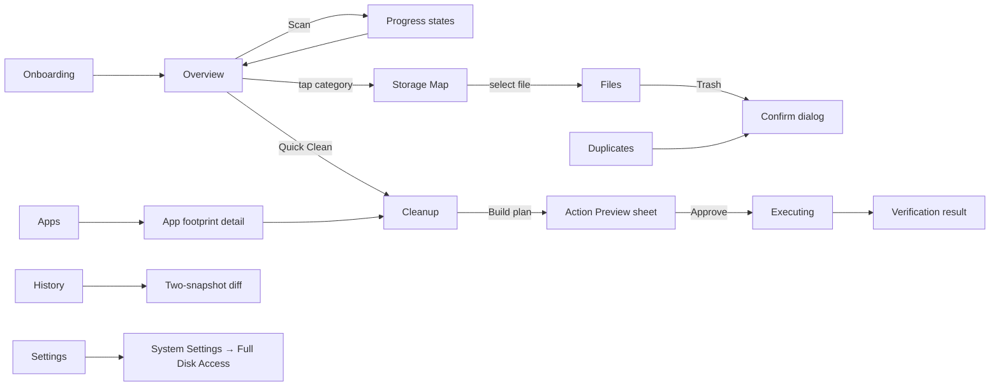

# 02 · UX / Information Architecture

## 1. Information architecture (v2 — "storage command center" design)

Single window, `NavigationSplitView` sidebar + detail. Dark theme enforced (`preferredColorScheme(.dark)`). No modality except cleanup preview/confirmation, onboarding, and target-cleanup sheets.

```
Disk Robo (sidebar)
├── (main)
│   ├── Overview        ← dashboard: volume / health / recoverable cards,
│   │                      sunburst map card, Top Consumers, Robo Insights,
│   │                      bottom status bar (last scan, files, speed, Deep Scan)
│   ├── Storage Map     ← full-size sunburst (gradient wedges, hover pop-out,
│   │                      tooltips with breakdown, breadcrumb drill-down)
│   ├── Cleanup Center
│   ├── Apps & Data     ← per-app footprints + leftovers (feeds Top Consumers)
│   ├── Duplicates
│   └── Large Files
├── Smart Tools
│   ├── Robo Radar      ← preview (real anomaly signals, Phase-2 badge)
│   ├── Growth Tracker  ← Swift Charts usage timeline + A/B diff
│   ├── Robo Assistant  ← Phase-2 placeholder (sidebar card too)
│   ├── Developer Tools ← developer candidates with trash flow
│   ├── Browser Data    ← browser cache candidates with trash flow
│   └── Uninstaller     ← Phase-2 preview + live leftovers list
└── System
    ├── Settings · Exclusions · Scan History
```

Sidebar also carries a persistent **Robo Assistant promo card** (Phase 2, "Soon" badge — honest labeling, no fake UI).

## 2. Screen map



Every destructive endpoint (Confirm1, Preview→Approve) routes through the Safety Engine; nothing reaches the filesystem without preview + confirmation.

## 3. User journeys

**J1 · First run (Sam):** Launch → onboarding explains Full Disk Access honestly ("measure storage used by apps and protected user-library locations; nothing is uploaded — Disk Robo has no network code") → Continue (with or without FDA) → Overview shows volume state + health prompt → "Scan My Home" → progress with live counters → insights appear.

**J2 · Free space (Maya):** Overview → "recoverable: X GB" → Cleanup → mode *Target* → enter 50 GB → Disk Robo builds the safest plan that reaches the target (greens first, then yellows, each with risk + explanation) → review item groups, uncheck anything → Preview → Confirm → items move to Trash → outcome reports freed bytes and any blocked items with reasons → "Emptying the Trash is always your decision."

**J3 · Mystery growth (Dev):** History → select last two snapshots → diff: "+18.4 GB Developer, top grower ~/Library/Developer/Xcode/DerivedData" → Cleanup → DerivedData candidates, each with impact note "Xcode will regenerate; next builds slower" → clean → rescan.

**J4 · Downloads graveyard (Sam):** Cleanup → Downloads group → old installers (yellow, "likely already used") → review list with paths + dates → trash selected.

**J5 · Duplicates (Priya):** Duplicates → scope Downloads → run → groups by wasted bytes → keep-newest preselected → trash the rest → safety re-verifies each file before trashing.

**J6 · App hoarding (Maya):** Apps → analyze → Final Cut Pro: bundle 5 GB, libraries 82 GB, caches 31 GB → "Clean caches" sheet → only the green cache portion is offered.

## 4. UX flows (states)

Every screen defines: empty state (no scan yet → single primary CTA), loading state (progressive, cancellable), success state, error state (what happened / why / is anything at risk / what to do). Cleanup execution flow: *Build plan → Preview (never hidden) → Explicit confirm → Per-item progress → Verified outcome (freed / blocked / failed with reasons) → Audit-log entry*.

## 5. Design system

- **Feel:** premium, calm, native, trustworthy; futuristic without gimmicks.
- **Typography:** system SF via semantic styles (`.title`, `.headline`, `.body`, `.caption`); monospaced digits (`.monospacedDigit()`) for all byte counts.
- **Color — categories:** applications blue · developer purple · caches cyan · downloads orange · trash gray · installers amber · archives brown · logs teal · browser green · media pink · documents yellow · system slate · other secondary.
- **Risk — never color-only:** Green "Safe" `checkmark.seal` · Yellow "Review" `eye` · Orange "Important" `exclamationmark.triangle` · Red "Protected" `lock.shield`. Every badge = color **and** symbol **and** label (accessibility requirement).
- **Components:** stat cards (rounded rect, quaternary fill, hairline border), insight rows (symbol + title + detail), risk badge, confidence label (Very High/High/Medium/Low — categorical, not fake-precise), segmented usage bars, sunburst canvas.
- **Motion:** Robo Core — a small central ring in Overview whose state encodes disk health (healthy green / scanning indigo dashes / warning amber / critical red pulse). All animation gated on `accessibilityReduceMotion`; no continuous animation while idle except the gentle Core pulse; nothing on GPU-heavy paths.
- **Empty/error states:** `ContentUnavailableView` with a single next action; errors always explain and offer recovery.

## 6. Wireframe descriptions

**Overview** — Header: "Why is my Mac running out of space?" + Robo Core ring + one-line answer. Row of stat cards: *Used/Free* (segmented bar), *Recoverable* (green total + Quick Clean button), *Disk Health* (score + top factor). Below: storage-by-category list (icon, bar, size, %) and Robo Insights feed. Scanning state replaces insights with live progress (files seen, bytes, current path) + top-level folders appearing as they complete.

**Storage Map** — Breadcrumb bar (root → … → current) at top; sunburst canvas fills the view (gradient category wedges + inner detail ring); hover tooltip shows name, category chip, size, % of parent, top children, actions (Reveal in Finder, Drill In); click a wedge to drill down; click the center hub to go up one level.

**Files** — Filter bar (category menu, min-size menu, search field) + table rows (icon, name, parent path, size, modified, category, risk) + toolbar actions (Reveal, Quick Look, Move to Trash with confirmation). Selection drives Quick Look via `.quickLookPreview`.

**Cleanup** — Header cards: green total / yellow total. Mode picker (Quick · Smart · Deep · Target + GB field). Plan list grouped by category in expandable rows with include-toggle, size, risk badge, confidence, and a "Why?" popover answering: What is this? Why does it exist? What happens if deleted? Can it come back? Bottom action bar: "Move N items to Trash · recover ~X GB" → preview sheet (grouped totals, risk summary, full item inspector) → confirm → execution progress → outcome summary.

**Duplicates** — Scope picker + minimum size + Run. Groups sorted by wasted bytes; each group lists files with path, size, modified; recommended keep is marked; selecting all copies of a group is blocked ("keep at least one"). Trash selected → confirm → verified execution.

**Apps** — Analyze button + list (icon, name, total, segmented breakdown bar). Row detail: bundle / Application Support / caches / containers / logs / other rows with sizes; actions: Reveal in Finder, Clean Caches (green-only sheet). Separate "Leftovers" section (orange, review-only, no bulk delete).

**History** — Snapshot list (date, used, free); compare picker → diff view (total delta, category deltas with arrows, top-20 directory changes); cleanup audit log (date, items, freed bytes); "clear history" behind confirmation in Settings.

**Settings** — Permissions card (FDA status + re-check + open System Settings + exact-scope explanation) · Exclusions (add via folder picker, remove) · Thresholds (free-space warning) · Data (retention, clear snapshots) · Privacy card ("All analysis is local. Metadata only. No network code exists in this app.") · About (version, roadmap pointer).

## 7. Accessibility checklist

VoiceOver labels on all interactive elements and sunburst segments (via accessibilityLabel on canvas overlay) · full keyboard navigation (sidebar, lists, buttons, focus states) · Dynamic Type via semantic fonts · minimum-contrast palette · reduced-motion honored everywhere · risk never communicated by color alone (symbol + text always).
