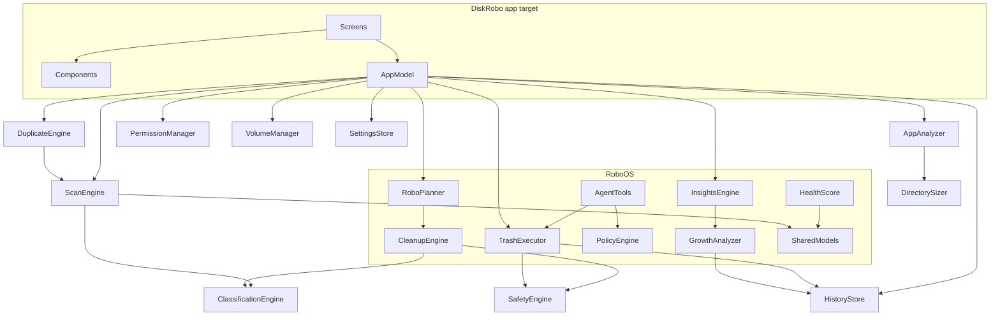

# 03 · Technical Architecture

## 1. Overview

Two build targets, strict layering:

- **`RoboCore`** (library, no UI, no AppKit) — models, scanning, classification, safety, cleanup, duplicates, apps, history, RoboOS (planner, insights, tools, policy). Fully unit-testable.
- **`DiskRobo`** (executable, SwiftUI) — screens, components, `AppModel` (@MainActor @Observable orchestrator).

```
UI (SwiftUI)  →  AppModel  →  RoboOS (Planner / Tools / Policy)  →  Engines  →  Models / Filesystem
                                                      ↘ SafetyEngine (veto authority) ↗
```

Rules: UI never touches the filesystem directly except via AppModel services; engines never import SwiftUI/AppKit; SafetyEngine is the only gate to destructive operations; no `StorageManager` god class.

## 2. Module graph



No cycles: Safety depends only on models; engines depend on Safety, never the reverse; RoboOS composes engines; AppModel composes everything for the UI.

## 3. Module responsibilities

| Module | Responsibility |
|---|---|
| `SharedModels` | `StorageNode`, categories, risk, confidence, scan events/results, snapshots, candidates, plans |
| `StorageScanner` | async bounded-concurrency tree walk, memory-bounded aggregation, packages, symlinks, cancellation, progressive events |
| `ClassificationEngine` | deterministic path/extension → category |
| `SafetyEngine` | protected paths, allowlist, risk classification, deletion validation (symlink escape, TOCTOU), veto |
| `TrashExecutor` | re-verify → trash → record audit entry → verify gone |
| `CleanupEngine` | rule-driven candidate discovery with explanations/confidence |
| `DuplicateEngine` | size → partial hash → full hash pipeline |
| `AppAnalyzer` | per-app footprints + leftovers |
| `HistoryStore` | snapshots, cleanup audit log, retention |
| `GrowthAnalyzer` | snapshot diffs, growth narratives |
| `RoboPlanner` | Quick/Smart/Deep/Target plan construction |
| `InsightsEngine`, `HealthScore` | deterministic insights; explained 0–100 score |
| `AgentTools`, `PolicyEngine` | typed tool layer + authorization (foundation for Phase-2 NL assistant) |
| `PermissionManager` | Full Disk Access probing, honest status |
| `VolumeManager` | volume inventory (internal/external, capacities) |

## 4. Agent architecture (RoboOS)

Spec agents map onto engines; "agents" are rule-driven components in MVP, LLM-orchestrated in Phase 2 through the *same* tool layer:

| Agent | MVP realization | Phase 2 |
|---|---|---|
| Storage Mapper | `ScanEngine` + `VolumeManager` | incremental SQLite index |
| Cleanup Intelligence | `CleanupEngine` rules | broader rules + learning |
| App Intelligence | `AppAnalyzer` | richer relationship graph |
| Growth Detective | `GrowthAnalyzer` diffs | recurring-growth detection |
| Duplicate Detective | `DuplicateEngine` | similarity, photo-aware |
| Large File Investigator | largest-file collector in scan | last-used via Spotlight metadata |
| Developer Storage | developer rules in `CleanupEngine` | deeper Docker/VM analysis |
| Browser Storage | browser cache rules | profile-aware |
| Safety Guardian | `SafetyEngine` (full veto authority) | unchanged — deterministic |
| Storage Forecast | — (Phase 2) | linear + confidence ranges |
| Robo Planner | `RoboPlanner` deterministic optimizer | unchanged; LLM only proposes, policy disposes |

## 5. Tool architecture

Agents (and the Phase-2 assistant) operate through typed tools only — **no shell execution, ever**. `AgentTool` protocol with `permission: readOnly | destructive`; `PolicyEngine.authorize` gates every call; destructive tools require a single-use `ApprovalToken` (issued by explicit UI confirmation, bound to exact paths, 5-minute TTL). Current tools: `listLargeFiles`, `getDirectorySize`, `inspectFileMetadata`, `findDuplicates`, `inspectApplicationStorage`, `queryStorageHistory`, `estimateRecoverableSpace`, `generateCleanupPlan`, `moveToTrash` (token-gated), `revealInFinder`.

## 6. Robo Planner flow

```
User intent ("give me 30 GB") → candidate set → rank by (risk, size) → greedy fill
  → CleanupPlan (items, expected recovery, risk summary, explanation)
  → Preview (UI) → user approval → ApprovalToken issued
  → TrashExecutor: re-stat each item (TOCTOU) → SafetyEngine.validate → trash → audit record
  → verify originals gone → outcome report (freed / blocked / failed)
```

Never is an LLM (or any heuristic) alone able to authorize deletion — plans execute only with user-issued tokens and per-item deterministic validation.

## 7. Filesystem scanning architecture

- **Async walk** with `Task.detached(priority: .utility)`; bounded parallel directory expansion (`TaskGroup`, default 8 concurrent subtrees); cooperative cancellation at every directory and file batch.
- **Memory-bounded aggregation:** directories and files ≥ 10 MB become tree nodes; smaller files are aggregated into per-directory `smallFileCount/bytes`. A 3-million-file volume materializes ~10⁵ nodes, not 3×10⁶.
- **Progressive results:** `directoryCompleted` events for shallow depths stream into the UI (top-level folders appear as they finish); `bufferingNewest` progress events keep memory flat.
- **Packages** (`.app`, `.bundle`, …) are treated as single leaves with a deep-enumerated size (bounded cost: packages contain few files).
- **Symlinks:** never followed — recorded, size 0, never deletion targets through links.
- **Inaccessible directories** (TCC) become flagged nodes with the error; counts surface honestly ("1,204 locations could not be inspected — grant Full Disk Access").
- **Known limitations (documented, not hidden):** logical `fileSize` is reported (matches Finder); hard-linked files with `nlink > 1` may be counted per-link on exotic setups; APFS clone accounting follows Finder semantics.

## 8. Incremental scanning plan (Phase 1.5)

MVP performs on-demand scans (full or quick). Phase 1.5 adds a SQLite index (see [05-data.md](05-data.md) §4): `files(file_id, path, parent, size, mtime, category, app_id, hash_status, risk)` with FSEvents-driven deltas, metadata caching, and "rescan only what changed". Justification for MVP's simpler choice: correctness of the engine and safety model first; the index is an accelerator, not a correctness dependency.

## 9. Performance strategy

Never block the main thread (all engines async; UI consumes events on MainActor) · bounded concurrency · memory-bounded tree · no hashing during scans (hashes only in duplicate pipeline, progressive) · sunburst renders top-N children via `Canvas` (two rings of wedges, no view explosion) · scan at utility priority · cancellable everywhere · no polling loops; background monitoring deferred to Phase 1.5 FSEvents (battery-friendly by design).

## 10. Edge-case analysis (spec §52)

| Case | Handling |
|---|---|
| Extremely full disks | Free-space warnings; scan writes nothing; trash-only (no temp copies) |
| Millions of tiny files | Aggregated below 10 MB threshold; bounded node count |
| Files changing during scan | Sizes are point-in-time; deletion re-verifies fingerprints (TOCTOU) |
| Aliases/symlinks | Never followed, never proposed for deletion via link |
| Hard links | Documented limitation (see §7); Phase 1.5 inode-aware index |
| Sparse files | Logical size reported (Finder parity) |
| Package bundles | Single leaf, deep-sized |
| Hidden files | Scanned (dot-files are where caches live) |
| Protected files | Flagged inaccessible; never counted as scanned |
| Cloud placeholders | Counted at placeholder size; deletion of placeholders is orange-risk (re-download cost) |
| APFS clones | Finder-parity logical accounting; no double-count via dedup of inode for nlink>1 not needed for clones |
| Local snapshots | Excluded from user scan; documented as system-managed |
| External disk removal | Volume UUID keyed snapshots; scan errors surface as disconnected-volume state |
| Multiple users | Scans current user's home; other homes inaccessible (flagged) |
| Encrypted volumes | Appear as normal volumes when mounted/unlocked |
| Network drives | Listed with warning; treated as slow scans, never auto-cleaned |
| VM images / Docker raw | Large-file investigator surfaces them; deletion requires explicit user selection (orange) |
| Incomplete downloads | `.download`/`.crdownload`/`.part` files flagged, orange risk |

## 11. Dependency gap register (spec §51)

Method: trace business objective → capability → flow → UI → module → data → API → permission → safety rule → error state. Gaps found during design, with resolution:

| ID | Gap | Severity | Resolution |
|---|---|---|---|
| G1 | NL assistant requires intent parser → tool layer bridge | P2 (Phase 2 feature) | Tool layer + policy engine already built; bridge is Phase-2 work, no MVP dependency |
| G2 | Forecast needs ≥ 2 weeks of snapshots | P2 | History capture ships in MVP so data accrues from day one |
| G3 | Incremental index absent in MVP | P1 | Documented plan (§8); full rescan acceptable, cancellable |
| G4 | Last-used metadata unavailable via FileManager | P2 | Phase 2: Spotlight/`kMDItemLastUsedDate` query engine |
| G5 | Hard-link double counting possible | P3 | Documented; rare in user domains; inode-aware index fixes |
| G6 | System Data decomposition partial (SIP-protected areas unscannable) | P1-by-design | Honest "Inspectable vs System-managed" split (never pretend) |
| G7 | Trash recovery ends when user empties Trash | P1-by-design | Communicated in every cleanup outcome |
| G8 | `volumeAvailableCapacity` includes purgeable space | P2 | Documented; Phase 2 uses `volumeAvailableCapacityForImportantUsage` + explanation |

No circular dependencies; no orphaned features (every UI screen maps to engines and back); every destructive path routes through SafetyEngine (verified by tests).
